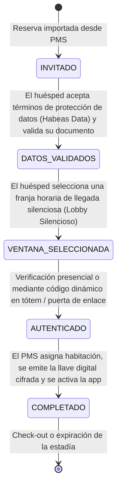
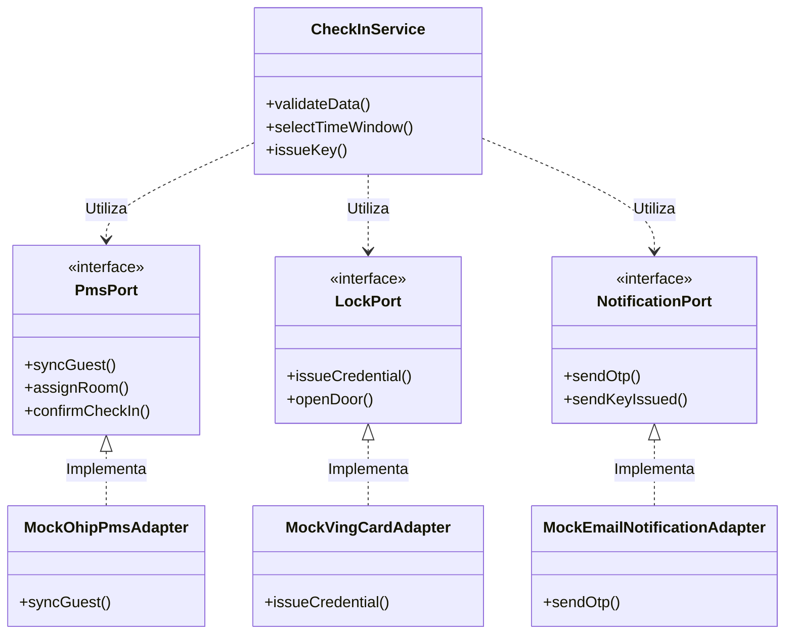
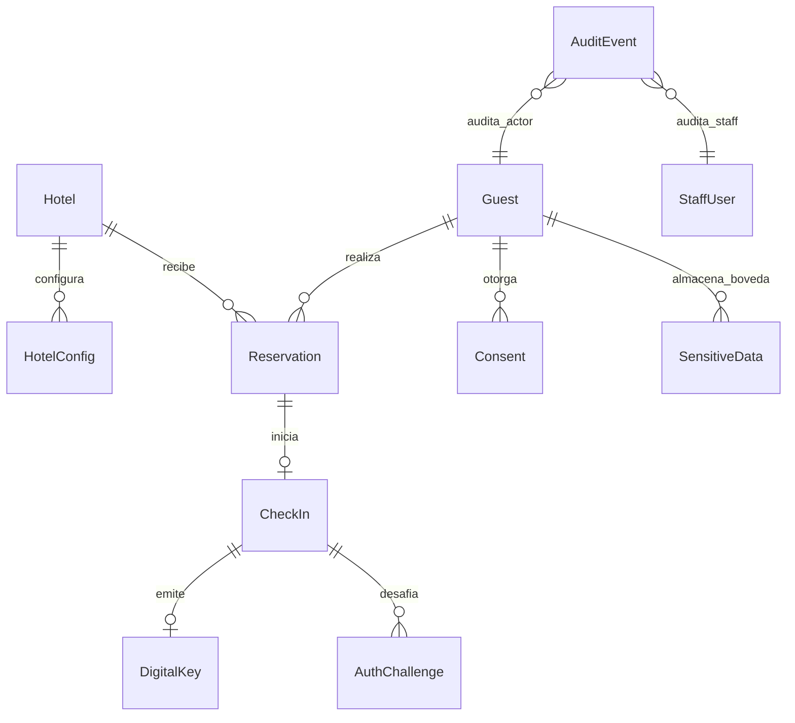

# Documento de Arquitectura y Seguridad 🛡️🏛️

Este documento describe en detalle las decisiones técnicas, flujos de datos, modelos de seguridad y el diseño de arquitectura del sistema **Check-in Inclusivo**.

---

## 1. Máquina de Estados del Check-in

Para garantizar un flujo controlado y libre de fricción para huéspedes con ansiedad social, el proceso de check-in digital se modela a través de una **Máquina de Estados Finita (FSM)**. Cada transición requiere validaciones estrictas y registra eventos en la bitácora de auditoría.



### Detalle de Estados:
- **`INVITADO`**: Estado inicial. La reserva se sincroniza desde el PMS del hotel. El huésped recibe un enlace único para iniciar su pre-check-in digital.
- **`DATOS_VALIDADOS`**: El huésped acepta el consentimiento de datos personales y opcionalmente digita su documento de identidad. Los datos sensibles se cifran inmediatamente.
- **`VENTANA_SELECCIONADA`**: El huésped elige una franja horaria de llegada. Esto permite al staff monitorear la congestión del lobby y preparar la habitación con anticipación.
- **`AUTENTICADO`**: En el hotel, el huésped escanea un código QR o introduce un OTP de un solo uso en la tablet del Tótem de Entrada sin interacción social directa. El estado cambia a autenticado.
- **`COMPLETADO`**: La cerradura inteligente emite una credencial y el PMS registra oficialmente al huésped. Se genera la llave digital en el dispositivo móvil del huésped.

---

## 2. Bóveda Criptográfica de Datos Sensibles (Habeas Data)

Para cumplir con la legislación colombiana de protección de datos personales (**Ley 1581 de 2012**), el sistema implementa un modelo de **cifrado a nivel de campo (Field-Level Encryption - FLE)** para datos sensibles del huésped (ej. número de documento de identidad).

### Arquitectura de Bóveda:
En lugar de almacenar datos identificativos directamente en la tabla `Guest`, los campos confidenciales se extraen y se almacenan en una tabla independiente llamada `SensitiveData`.

```text
       Guest Table                       SensitiveData Table
┌─────────────────────────┐       ┌───────────────────────────────────┐
│ id: "guest-uuid"        │       │ id: "vault-uuid"                  │
│ firstName: "Juan"       │ ───►  │ guestId: "guest-uuid"             │
│ email: "juan@email.com" │       │ dataType: "IDENTITY_DOCUMENT"     │
│ ...                     │       │ encryptedValue: "a3f5b721e8d..."  │
└─────────────────────────┘       │ encryptionIv: "9b2c7e01..."       │
                                  └───────────────────────────────────┘
```

### Algoritmo de Cifrado:
Se utiliza **AES-256-CBC** implementado de forma segura en [vault.helper.ts](file:///d:/DEV/checkin-inclusivo/apps/api/src/common/vault.helper.ts):
- **Clave Simétrica**: Clave de 32 bytes provista mediante la variable de entorno `VAULT_ENCRYPTION_KEY`.
- **Vector de Inicialización (IV)**: Generado de forma aleatoria (16 bytes criptográficos) por cada operación de cifrado para prevenir ataques de análisis de frecuencia de bloques.

---

## 3. Arquitectura Hexagonal y Puertos de Integración

El backend NestJS utiliza una estructura desacoplada (Puertos y Adaptadores) para aislar las reglas del negocio de los sistemas de terceros o mockups.



---

## 4. Esquema y Relaciones de Base de Datos (Entity-Relationship)

El modelo de datos relacional se estructura de la siguiente manera:



### Descripción de Entidades Clave:
- **`HotelConfig`**: Guarda preferencias del lobby silencioso (si está activo) y las ventanas horarias de llegada configuradas en formato JSON estructurado.
- **`Consent`**: Historial inmutable de las políticas de privacidad aceptadas por el huésped, detallando las versiones y propósitos autorizados (scopes).
- **`AuthChallenge`**: Almacena de forma segura (mediante hash SHA-256) los valores OTP y códigos QR activos que sirven para autenticar al huésped presencialmente.
- **`AuditEvent`**: Registro inmutable de auditoría para fines de cumplimiento, que rastrea quién, cuándo y qué acción de seguridad o datos se ejecutó.
